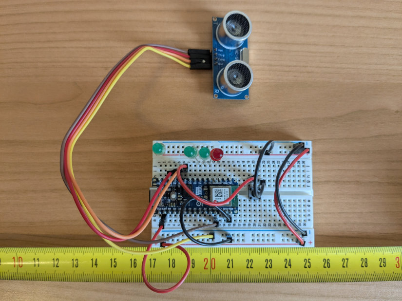
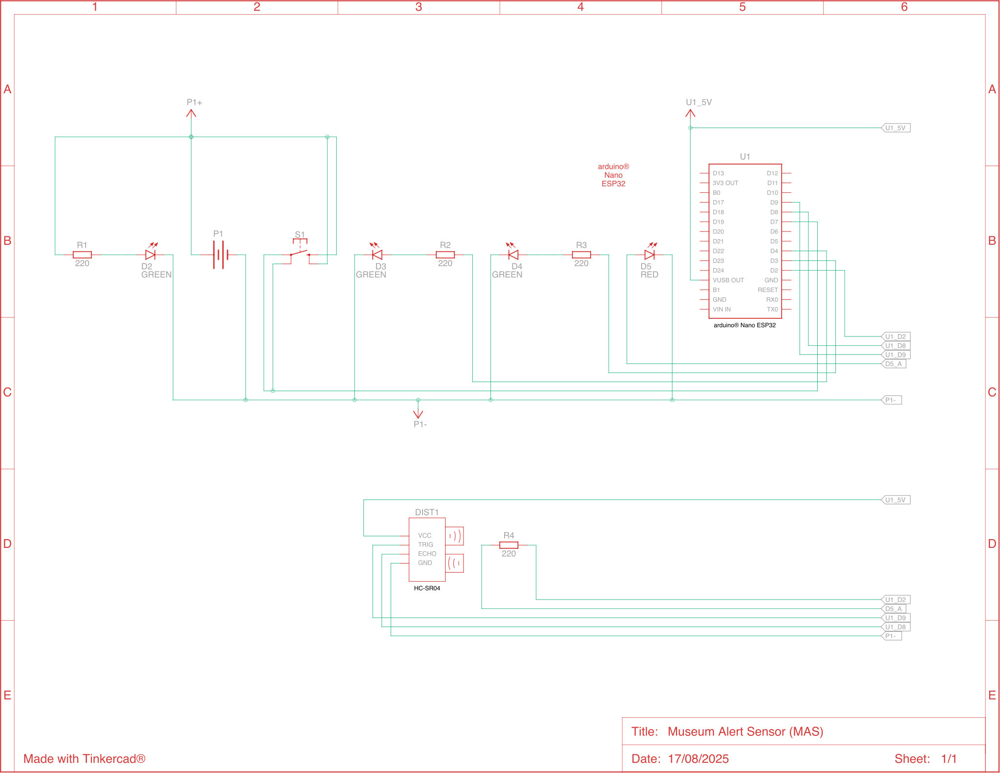

# Museum Alert Sensor (MAS)

[![License][license-badge]](LICENSE.md)
[](https://github.com/humana-fragilitas/museum-alert-sketch/actions/workflows/arduino-ci.yml)

Arduino® Nano ESP32-based ultrasonic distance sensor, comprising electrical schematic and firmware required to build the device, part of the ["Museum Alert"](https://github.com/humana-fragilitas/museum-alert) project.



## Electrical Schematic
📄 [.pdf format](./docs/images/electrical_schematic.pdf)




## Bill of Materials

| Q.ty   | Component                                            |
|--------|------------------------------------------------------|
| 1      | Breadboard (5 columns on each side, dual power rails)|
| 1      | Arduino® Nano ESP32                                  |
| 1      | HC-SR04 ultrasonic sensor                            |
| 3      | Green led                                            |
| 1      | Red led                                              |
| 1      | 4-pin push button                                    |
| 4      | 220Ω resistor                                        |
| 4      | Pin Jumper Wire (Male-Female)                        |
| 6      | Pin Jumper Wire (Male-Male)                          |

## Arduino® Nano ESP32 Specifications Summary

|                  |                                  |                                                                       |
|------------------|----------------------------------|-----------------------------------------------------------------------|
| **Board**        | Name                             | Arduino® Nano ESP32                                                   |
|                  | SKU                              | ABX00092                                                              |
| **Microcontroller** | –                             | u-blox® NORA-W106 (ESP32-S3)                                          |
| **USB connector**   | –                             | USB-C®                                                                |
| **Pins**         | Built-in LED Pin                 | 13                                                                    |
|                  | Built-in RGB LED pins            | 14–16                                                                 |
|                  | Digital I/O Pins                 | 14                                                                    |
|                  | Analog input pins                | 8                                                                     |
|                  | PWM pins                         | 5                                                                     |
|                  | External interrupts              | All digital pins                                                      |
| **Connectivity** | Wi-Fi®                           | u-blox® NORA-W106 (ESP32-S3)                                          |
|                  | Bluetooth®                       | u-blox® NORA-W106 (ESP32-S3)                                          |
| **Communication**| UART                             | 2x                                                                    |
|                  | I2C                              | 1x, A4 (SDA), A5 (SCL)                                                |
|                  | SPI                              | D11 (COPI), D12 (CIPO), D13 (SCK); any GPIO for Chip Select (CS)      |
| **Power**        | I/O Voltage                      | 3.3 V                                                                 |
|                  | Input voltage (nominal)          | 6–21 V                                                                |
|                  | Source Current per I/O Pin       | 40 mA                                                                 |
|                  | Sink Current per I/O Pin         | 28 mA                                                                 |
| **Clock speed**  | Processor                        | up to 240 MHz                                                         |
| **Memory**       | ROM                              | 384 kB                                                                |
|                  | SRAM                             | 512 kB                                                                |
|                  | External Flash                   | 128 Mbit (16 MB)                                                      |
|                  | RAM                              | 8 MB (NORA-W106-10B)                                                  |
| **Dimensions**   | Width                            | 18 mm                                                                 |
|                  | Length                           | 45 mm                                                                 |

Full technical specifications are available on [manufactorer's website](https://store.arduino.cc/products/nano-esp32).

## HC-SR04 Ultrasonic Sensor Specifications Summary

|                |                          |                                               |
|----------------|--------------------------|-----------------------------------------------|
| **General**    | Model                    | HC-SR04                                       |
|                | Sensor Type              | Ultrasonic Distance Sensor                    |
|                | Operating Principle      | Echo ranging                                  |
| **Electrical** | Operating Voltage        | 5 V                                           |
|                | Operating Current        | 15 mA                                         |
|                | Working Frequency        | 40 kHz                                        |
| **Performance**| Measuring Range          | 2 cm – 400 cm                                 |
|                | Accuracy                 | ±3 mm                                         |
|                | Effectual Angle          | < 15°                                         |
|                | Resolution               | ~0.3 cm                                       |
| **Interface**  | Trigger Input Pulse      | ≥10 µs                                        |
|                | Echo Output Pulse        | TTL pulse proportional to distance            |
|                | Interface Type           | Digital (TTL)                                 |
|                | Connector Type           | 4-pin header                                  |
|                | Pinout                   | VCC, Trig, Echo, GND                          |
| **Timing**     | Measuring Cycle          | ~60 ms                                        |
|                | Response Time            | ~750 µs                                       |
| **Physical**   | Dimensions               | 45 mm × 20 mm × 15 mm                         |
|                | Weight                   | ~10 g                                         |

## Flashing the Arduino Nano ESP32 Sketch

⚠️ **Please read the [disclaimer](#disclaimer) before using this project.**

### Prerequisites

Before flashing the sketch, you must complete these essential steps:

#### 1. Deploy the Museum Alert API Infrastructure

**The device requires a deployed AWS IoT Core endpoint to function.** You must first deploy the [museum-alert-api](https://github.com/humana-fragilitas/museum-alert-api) AWS CDK project.

#### 2. Configure AWS IoT Core Endpoint

After deploying the museum-alert-api project:

1. **locate the endpoint in CDK deployment output** - Look for the `ArduinoSketchConfiguration` output in your deployment console;
2. **copy the configuration snippet** provided in the deployment output;
3. **update `config.h`** - Replace the AWS IoT Core endpoint configuration in `config.h`:

```cpp
namespace AWS {

  static constexpr const char* IOT_CORE_ENDPOINT = "<IOT_CORE_ENDPOINT>";

}
```

**Alternative methods to find your endpoint:**
- AWS Console: IoT Core > Settings > Device data endpoint;
- AWS CLI: `aws iot describe-endpoint --endpoint-type iot:Data-ATS`.

**Important:** The device will not function without a valid AWS IoT Core endpoint. This endpoint handles device authentication, message routing, and integration with other AWS services in the Museum Alert ecosystem.

### Requirements

Before flashing, make sure you have the following:

- Arduino IDE (version 2.x recommended);
- Museum Alert Sensor (MAS) built as per electrical schematic above;
- USB-C cable;
- Internet connection (to install libraries and test the device);
- **AWS IoT Core endpoint configured** (see Prerequisites above).

### Required Libraries

The sketch depends on two external libraries:

| Library                                                             | Version |
|---------------------------------------------------------------------|---------|
| [ArduinoJson](https://docs.arduino.cc/libraries/arduinojson/)       | 7.4.2   |
| [PubSubClient](https://docs.arduino.cc/libraries/pubsubclient/)     | 2.8     |

You can install them via the Arduino Library Manager:

1. open the Arduino IDE;
2. go to **Tools → Manage Libraries...**;
3. search for **ArduinoJson** and install version **7.4.2** or above;
4. search for **PubSubClient** and install version **2.8** or above.

Alternatively, you can add them manually to your `lib` folder if you're using PlatformIO or another build system.

### Connecting the Board

1. Plug your Museum Alert Sensor into your computer using a USB-C cable;
2. in the Arduino IDE, go to **Tools → Board** and select **Arduino Nano ESP32**;
3. select the correct **port** under **Tools → Port**.

### Flashing the Sketch

1. Open the sketch file (`.ino`) from this repository;
2. click the **Upload** button (right arrow icon);
3. wait for the sketch to compile and upload;
4. once complete, the board will automatically reset and begin running the sketch.

### Verifying Installation

After flashing:
- open the **Serial Monitor** (Tools → Serial Monitor);
- you should see debug output or sensor status messages confirming the sketch is running.

**Important**: before using the **["Museum Alert Desktop"](https://github.com/humana-fragilitas/museum-alert-desktop)** application with this device, make sure to **close the Arduino IDE** (including the Serial Monitor). The USB port can only be used by one application at a time, and leaving the Arduino IDE open will prevent the desktop application from connecting to the device.

### Troubleshooting

- If upload fails, press the **RESET** button on the sensor's board and try again;
- ensure no other application is using the serial port;
- double-check that the correct board and port are selected.

## Device Communication Protocol

### Device States (AppState)

The device operates through a finite state machine with the following states:

| State | Description | Available Commands |
|-------|-------------|-------------------|
| **STARTED** | Initial state when device boots up | None |
| **CONFIGURE_WIFI** | Device is waiting for WiFi credentials | `REFRESH_WIFI_CREDENTIALS`, `SET_WIFI_CREDENTIALS` |
| **CONNECT_TO_WIFI** | Device is attempting to connect to WiFi | None (automatic transition) |
| **CONFIGURE_CERTIFICATES** | Device is waiting for provisioning certificates | `SET_PROVISIONING_CERTIFICATES` |
| **PROVISION_DEVICE** | Device is registering with AWS IoT Core | None (automatic transition) |
| **CONNECT_TO_MQTT_BROKER** | Device is connecting to MQTT broker | None (automatic transition) |
| **DEVICE_INITIALIZED** | Device is operational and monitoring distance | All MQTT commands |
| **FATAL_ERROR** | Device encountered an unrecoverable error | `HARD_RESET` |

### USB Commands (Serial Communication)

The device accepts commands via USB serial port using JSON format wrapped with `<|` and `|>` markers.

#### Command Format
```json
<|{
  "cid": "<correlation_id>",
  "commandType": <command_type_number>,
  "payload": { /* command-specific data */ }
}|>
```

#### Available USB Commands

| Command | Type ID | Available States | Payload | Description |
|---------|---------|------------------|---------|-------------|
| **SET_WIFI_CREDENTIALS** | 2 | `CONFIGURE_WIFI` | `{"ssid": "network_name", "password": "network_password"}` | Sets WiFi network credentials |
| **REFRESH_WIFI_CREDENTIALS** | 1 | `CONFIGURE_WIFI` | None | Requests fresh WiFi networks scan |
| **SET_PROVISIONING_CERTIFICATES** | 0 | `CONFIGURE_CERTIFICATES` | `{"clientCert": "...", "privateKey": "...", "idToken": "..."}` | Provides AWS IoT provisioning certificates |
| **HARD_RESET** | 3 | `FATAL_ERROR` | None | Forces device reset and storage wipe |

#### USB Response Messages

The device sends responses in JSON format wrapped with `<|` and `|>` markers:

| Message Type | Type ID | Description |
|--------------|---------|-------------|
| **APP_STATE** | 0 | Current device state notification |
| **WIFI_NETWORKS_LIST** | 1 | Available WiFi networks |
| **ERROR** | 2 | Error notification with error code |
| **ACKNOWLEDGMENT** | 3 | Command acknowledgment |

#### Sample USB Response Messages

**APP_STATE** - Device state change notification:
```json
<|{
  "type": 0,
  "sn": "MAS-EC357A188534",
  "data": {
    "appState": 2
  }
}|>
```

**WIFI_NETWORKS_LIST** - Available WiFi networks scan result:
```json
<|{
  "type": 1,
  "sn": "MAS-EC357A188534",
  "cid": "MAS-EC357A188534-a6a2c35b-9f74-4af8-8b0c-5f35c7e6f992-1756458740990",
  "data": [
    {
      "ssid": "Home_WiFi_5G",
      "rssi": -42,
      "encryptionType": 3
    },
    {
      "ssid": "Office_Network",
      "rssi": -67,
      "encryptionType": 3
    }
  ]
}|>
```

**ERROR** - Error notification with error codes:
```json
<|{
  "type": 2,
  "sn": "MAS-EC357A188534",
  "cid": "MAS-EC357A188534-a6a2c35b-9f74-4af8-8b0c-5f35c7e6f992-1756458740990",
  "data": {
    "error": 0
  }
}|>
```

**ACKNOWLEDGMENT** - Command acknowledgment:
```json
<|{
  "type": 3,
  "sn": "MAS-EC357A188534",
  "cid": "MAS-EC357A188534-a6a2c35b-9f74-4af8-8b0c-5f35c7e6f992-1756458740990"
}|>
```

#### Error Codes Reference

| Error Code | Error Type | Description |
|------------|------------|-------------|
| 0 | INVALID_WIFI_CREDENTIALS | WiFi credentials are invalid or missing |
| 1 | FAILED_WIFI_CONNECTION_ATTEMPT | Unable to connect to WiFi network |
| 2 | INVALID_DEVICE_PROVISIONING_SETTINGS | Provisioning certificates are invalid |
| 3 | INVALID_DEVICE_COMMAND | Unknown or invalid command received |
| 4 | FAILED_PROVISIONING_SETTINGS_STORAGE | Cannot save provisioning data to storage |
| 5 | FAILED_DEVICE_PROVISIONING_ATTEMPT | Device registration with AWS IoT failed |
| 6 | FAILED_MQTT_BROKER_CONNECTION | Cannot connect to MQTT broker |
| 7 | FAILED_DEVICE_CONFIGURATION_RETRIEVAL | Cannot load device configuration |
| 8 | FAILED_SENSOR_DETECTION_REPORT | Cannot send sensor data via MQTT |

### MQTT Commands (Wireless Communication)

When in `DEVICE_INITIALIZED` state, the device accepts commands via MQTT on topic:
`companies/{company_id}/devices/{device_id}/commands`

#### MQTT Command Format
```json
{
  "type": <command_type_number>,
  "cid": "correlation_id",
  "data": { /* command-specific data */ }
}
```

#### Available MQTT Commands

| Command | Type ID | Payload | Description |
|---------|---------|---------|-------------|
| **RESET** | 0 | None | Remotely resets the device |
| **GET_CONFIGURATION** | 1 | None | Retrieves current device configuration |
| **SET_CONFIGURATION** | 2 | `{"distance": 25.0, "beaconUrl": "https://example.com"}` | Updates device configuration |

#### Configuration Parameters

| Parameter | Type | Range | Description |
|-----------|------|-------|-------------|
| **distance** | Float | 2.0 - 400.0 cm | Minimum distance threshold for alarm |
| **beaconUrl** | String | Max 18 chars (encoded) | BLE beacon Eddystone-URL |

#### MQTT Messages

The device publishes messages on topic:
`companies/{company_id}/devices/{device_id}/events`

| Message Type | Type ID | Description |
|--------------|---------|-------------|
| **ALARM** | 0 | Distance threshold breach detected |
| **CONNECTION_STATUS** | 1 | Device connectivity status |
| **CONFIGURATION** | 2 | Current device configuration (response to GET_CONFIGURATION) |
| **ACK** | 3 | Command acknowledgment |

#### Sample MQTT Messages

**ALARM** - Distance threshold breach notification:
```json
{
  "type": 0,
  "data": {
    "distance": 18
  }
}
```

**CONNECTION_STATUS** - Device connectivity status (sent automatically):
```json
{
  "type": 1,
  "data": {
    "connected": true,
    "timestamp": 1693276800
  }
}
```

**CONFIGURATION** - Current device configuration (response to GET_CONFIGURATION):
```json
{
  "type": 2,
  "cid": "MAS-EC357A188534-a6a2c35b-9f74-4af8-8b0c-5f35c7e6f992-1756458740990",
  "data": {
    "distance": 30.0,
    "beaconUrl": "https://example.com",
    "firmware": "1.0.0"
  }
}
```

**ACK** - Command acknowledgment (response to RESET or SET_CONFIGURATION):
```json
{
  "type": 3,
  "cid": "MAS-EC357A188534-a6a2c35b-9f74-4af8-8b0c-5f35c7e6f992-1756458740990"
}
```

## Hardware Controls and Indicators

### Reset Button

The device includes a custom reset button (separate from the Arduino's built-in reset) connected to **pin 7**.

**Behavior:**
- **Button Press**: any press of the reset button triggers a device reset;
- **Function**: erases all stored settings (WiFi credentials, certificates, configuration) and restarts the device;
- **Use Case**: factory reset when device needs to be reconfigured or is in an unrecoverable state.

### LED Indicators

The device has **4 LEDs** that provide visual feedback about the current device state and status:

| LED | Pin | Color | Function |
|-----|-----|-------|----------|
| **WiFi** | 4 | Green | WiFi connection status |
| **Status** | 3 | Green | Device state indicator |
| **Alarm** | 2 | Red | Distance alarm status |
| **Sensor Power** | - | Green | Ultrasonic sensor power (always on) |

### LED Behavior by Device State

| Device State | WiFi LED | Status LED | Alarm LED | Description |
|--------------|----------|------------|-----------|-------------|
| **STARTED** | OFF | Slow blink (520ms) | OFF | Device booting up |
| **CONFIGURE_WIFI** | OFF | Medium blink (260ms) | OFF | Waiting for WiFi credentials |
| **CONNECT_TO_WIFI** | OFF | Slow blink (520ms) | OFF | Attempting WiFi connection |
| **CONFIGURE_CERTIFICATES** | OFF | Medium blink (260ms) | OFF | Waiting for provisioning certificates |
| **PROVISION_DEVICE** | OFF | Fast blink (130ms) | OFF | Registering with AWS IoT Core |
| **CONNECT_TO_MQTT_BROKER** | ON | Slow blink (520ms) | OFF | Connecting to MQTT broker |
| **DEVICE_INITIALIZED** | ON | Solid ON | Variable | Device operational and monitoring |
| **FATAL_ERROR** | Variable | Very fast blink (75ms) | OFF | Unrecoverable error state |

### LED Status During Operation

**WiFi LED (Green, Pin 4):**
- **ON**: WiFi connected;
- **OFF**: WiFi disconnected.

**Status LED (Green, Pin 3):**
- **Solid ON**: device fully operational (DEVICE_INITIALIZED state);
- **Slow Blink (520ms)**: starting up or transitioning;
- **Medium Blink (260ms)**: waiting for configuration input;
- **Fast Blink (130ms)**: active provisioning process;
- **Very Fast Blink (75ms)**: fatal error - device reset required.

**Alarm LED (Red, Pin 2):**
- **ON**: distance threshold breached (object detected within alarm distance);
- **OFF**: no alarm condition (distance above threshold);
- **Note**: only active when device is in DEVICE_INITIALIZED state.

## Disclaimer

### Important Notice

This open source project, including all its submodules, documentation, and associated code (collectively, the "Project"), is provided for educational and experimental purposes only.

### No Warranty

THE PROJECT IS PROVIDED "AS IS", WITHOUT WARRANTY OF ANY KIND, EXPRESS OR IMPLIED, INCLUDING BUT NOT LIMITED TO THE WARRANTIES OF MERCHANTABILITY, FITNESS FOR A PARTICULAR PURPOSE, AND NONINFRINGEMENT. THE AUTHOR MAKES NO WARRANTIES ABOUT THE ACCURACY, RELIABILITY, COMPLETENESS, OR TIMELINESS OF THE PROJECT OR ITS COMPONENTS.

### Limitation of Liability

IN NO EVENT SHALL THE AUTHOR BE LIABLE FOR ANY CLAIM, DAMAGES, OR OTHER LIABILITY, WHETHER IN AN ACTION OF CONTRACT, TORT, OR OTHERWISE, ARISING FROM, OUT OF, OR IN CONNECTION WITH THE PROJECT OR THE USE OR OTHER DEALINGS IN THE PROJECT. THIS INCLUDES, BUT IS NOT LIMITED TO:

- **AWS Costs**: any charges incurred from AWS services deployed using the provided CDK templates;
- **Hardware Damage**: damage to Arduino boards, sensors, or other electronic components;
- **Data Loss**: loss of data or configuration settings;
- **Service Interruptions**: downtime or interruptions to connected services;
- **Security Issues**: any security vulnerabilities or breaches;
- **Indirect Damages**: lost profits, business interruption, or consequential damages of any kind.

### User Responsibility

By using this Project, you acknowledge and agree that:

1. **you use the Project entirely at your own risk**;
2. **you are responsible for understanding AWS pricing** and monitoring your usage to avoid unexpected charges;
3. **you should implement appropriate security measures** for any production deployments;
4. **you are responsible for compliance** with all applicable laws and regulations in your jurisdiction;
5. **you should test thoroughly** in development environments before any production use;
6. **you are responsible for backing up** any important data or configurations.

### AWS Specific Notice

This project may create AWS resources that incur charges; users are solely responsible for:
- understanding AWS pricing models;
- monitoring their AWS usage and costs;
- properly terminating or deleting resources when no longer needed;
- reviewing and understanding all CloudFormation templates before deployment.

### Third-Party Components

This Project may include or reference third-party libraries, services, or components. The author is not responsible for the functionality, security, or licensing of these third-party components. Users should review and comply with all applicable third-party licenses and terms of service.

### Modification and Distribution

Users may modify and distribute this Project under the terms of the applicable open source license. However, any modifications or distributions must include this disclaimer, and the author bears no responsibility for modified versions of the Project.

### Professional Advice

This Project is not intended to replace professional consultation. For production systems or critical applications, please consult with qualified professionals in the relevant fields.

### Acknowledgments

By downloading, cloning, forking, or otherwise using this Project, you acknowledge that you have read, understood, and agree to be bound by this disclaimer.

---

[license-badge]: https://img.shields.io/badge/License-MIT-blue.svg