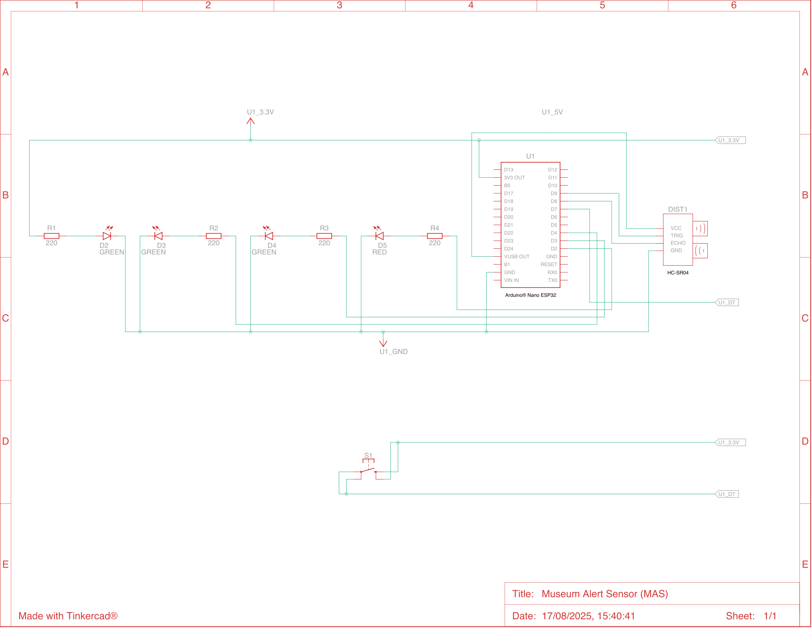

# Museum Alert Sensor (MAS)

[![License][license-badge]](LICENSE.md)
[](https://github.com/humana-fragilitas/museum-alert-sketch/actions/workflows/arduino-ci.yml)

Arduino® Nano ESP32-based ultrasonic distance sensor, comprising electrical schematic and firmware required to build the device, part of the ["Museum Alert"](https://github.com/humana-fragilitas/museum-alert) project.


## Electrical Schematic
📄 [.pdf format](./docs/images/electrical_schematic.pdf)




## Bill of Materials

| Q.ty   | Component                                            |
|--------|------------------------------------------------------|
| 1      | Breadboard (5 columns on each side, dual power rails)|
| 1      | Arduino® Nano ESP32                                  |
| 1      | HC-SR04 ultrasonic sensor                            |
| 3      | Green led                                            |
| 1      | Red led                                              |
| 1      | 4-pin push button                                    |
| 4      | 220Ω resistor                                        |
| 4      | Pin Jumper Wire (Male-Female)                        |
| 6      | Pin Jumper Wire (Male-Male)                          |

## Arduino® Nano ESP32 Specifications Summary

|                  |                                  |                                                                       |
|------------------|----------------------------------|-----------------------------------------------------------------------|
| **Board**        | Name                             | Arduino® Nano ESP32                                                   |
|                  | SKU                              | ABX00092                                                              |
| **Microcontroller** | –                             | u-blox® NORA-W106 (ESP32-S3)                                          |
| **USB connector**   | –                             | USB-C®                                                                |
| **Pins**         | Built-in LED Pin                 | 13                                                                    |
|                  | Built-in RGB LED pins            | 14–16                                                                 |
|                  | Digital I/O Pins                 | 14                                                                    |
|                  | Analog input pins                | 8                                                                     |
|                  | PWM pins                         | 5                                                                     |
|                  | External interrupts              | All digital pins                                                      |
| **Connectivity** | Wi-Fi®                           | u-blox® NORA-W106 (ESP32-S3)                                          |
|                  | Bluetooth®                       | u-blox® NORA-W106 (ESP32-S3)                                          |
| **Communication**| UART                             | 2x                                                                    |
|                  | I2C                              | 1x, A4 (SDA), A5 (SCL)                                                |
|                  | SPI                              | D11 (COPI), D12 (CIPO), D13 (SCK); any GPIO for Chip Select (CS)      |
| **Power**        | I/O Voltage                      | 3.3 V                                                                 |
|                  | Input voltage (nominal)          | 6–21 V                                                                |
|                  | Source Current per I/O Pin       | 40 mA                                                                 |
|                  | Sink Current per I/O Pin         | 28 mA                                                                 |
| **Clock speed**  | Processor                        | up to 240 MHz                                                         |
| **Memory**       | ROM                              | 384 kB                                                                |
|                  | SRAM                             | 512 kB                                                                |
|                  | External Flash                   | 128 Mbit (16 MB)                                                      |
|                  | RAM                              | 8 MB (NORA-W106-10B)                                                  |
| **Dimensions**   | Width                            | 18 mm                                                                 |
|                  | Length                           | 45 mm                                                                 |

Full technical specifications are available on [manufactorer's website](https://store.arduino.cc/products/nano-esp32).

## HC-SR04 Ultrasonic Sensor Specifications Summary

|                |                          |                                               |
|----------------|--------------------------|-----------------------------------------------|
| **General**    | Model                    | HC-SR04                                       |
|                | Sensor Type              | Ultrasonic Distance Sensor                    |
|                | Operating Principle      | Echo ranging                                  |
| **Electrical** | Operating Voltage        | 5 V                                           |
|                | Operating Current        | 15 mA                                         |
|                | Working Frequency        | 40 kHz                                        |
| **Performance**| Measuring Range          | 2 cm – 400 cm                                 |
|                | Accuracy                 | ±3 mm                                         |
|                | Effectual Angle          | < 15°                                         |
|                | Resolution               | ~0.3 cm                                       |
| **Interface**  | Trigger Input Pulse      | ≥10 µs                                        |
|                | Echo Output Pulse        | TTL pulse proportional to distance            |
|                | Interface Type           | Digital (TTL)                                 |
|                | Connector Type           | 4-pin header                                  |
|                | Pinout                   | VCC, Trig, Echo, GND                          |
| **Timing**     | Measuring Cycle          | ~60 ms                                        |
|                | Response Time            | ~750 µs                                       |
| **Physical**   | Dimensions               | 45 mm × 20 mm × 15 mm                         |
|                | Weight                   | ~10 g                                         |

## Flashing the Arduino Nano ESP32 Sketch

### Requirements

Before flashing, make sure you have the following:

- Arduino IDE (version 2.x recommended);
- Museum Alert Sensor (MAS) built as per electrical schematic above;
- USB-C cable;
- Internet connection (to install libraries and test the device).

### Required Libraries

The sketch depends on two external libraries:

| Library                                                             | Version |
|---------------------------------------------------------------------|---------|
| [ArduinoJson](https://docs.arduino.cc/libraries/arduinojson/)       | 7.4.2   |
| [PubSubClient](https://docs.arduino.cc/libraries/pubsubclient/)     | 2.8     |

You can install them via the Arduino Library Manager:

1. Open the Arduino IDE.
2. Go to **Tools → Manage Libraries...**
3. Search for **ArduinoJson** and install version **7.4.2** or above.
4. Search for **PubSubClient** and install version **2.8** or above.

Alternatively, you can add them manually to your `lib` folder if you're using PlatformIO or another build system.

### Connecting the Board

1. Plug your Museum Alert Sensor into your computer using a USB-C cable;
2. in the Arduino IDE, go to **Tools → Board** and select **Arduino Nano ESP32**;
3. select the correct **port** under **Tools → Port**.

### Flashing the Sketch

1. Open the sketch file (`.ino`) from this repository;
2. click the **Upload** button (right arrow icon);
3. wait for the sketch to compile and upload;
4. once complete, the board will automatically reset and begin running the sketch.

### Verifying Installation

After flashing:
- Open the **Serial Monitor** (Tools → Serial Monitor);
- you should see debug output or sensor status messages confirming the sketch is running.

### Troubleshooting

- If upload fails, press the **RESET** button on the sensor's board and try again;
- ensure no other application is using the serial port;
- double-check that the correct board and port are selected.

## Device Communication Protocol

### Device States (AppState)

The device operates through a finite state machine with the following states:

| State | Description | Available Commands |
|-------|-------------|-------------------|
| **STARTED** | Initial state when device boots up | None |
| **CONFIGURE_WIFI** | Device is waiting for WiFi credentials | `REFRESH_WIFI_CREDENTIALS`, `SET_WIFI_CREDENTIALS` |
| **CONNECT_TO_WIFI** | Device is attempting to connect to WiFi | None (automatic transition) |
| **CONFIGURE_CERTIFICATES** | Device is waiting for provisioning certificates | `SET_PROVISIONING_CERTIFICATES` |
| **PROVISION_DEVICE** | Device is registering with AWS IoT Core | None (automatic transition) |
| **CONNECT_TO_MQTT_BROKER** | Device is connecting to MQTT broker | None (automatic transition) |
| **DEVICE_INITIALIZED** | Device is operational and monitoring distance | All MQTT commands |
| **FATAL_ERROR** | Device encountered an unrecoverable error | `HARD_RESET` |

### USB Commands (Serial Communication)

The device accepts commands via USB serial port using JSON format wrapped with `<|` and `|>` markers.

#### Command Format
```json
<|{
  "cid": "correlation_id",
  "commandType": <command_type_number>,
  "payload": { /* command-specific data */ }
}|>
```

#### Available USB Commands

| Command | Type ID | Available States | Payload | Description |
|---------|---------|------------------|---------|-------------|
| **SET_WIFI_CREDENTIALS** | 2 | `CONFIGURE_WIFI` | `{"ssid": "network_name", "password": "network_password"}` | Sets WiFi network credentials |
| **REFRESH_WIFI_CREDENTIALS** | 1 | `CONFIGURE_WIFI` | None | Requests fresh WiFi networks scan |
| **SET_PROVISIONING_CERTIFICATES** | 0 | `CONFIGURE_CERTIFICATES` | `{"clientCert": "...", "privateKey": "...", "idToken": "..."}` | Provides AWS IoT provisioning certificates |
| **HARD_RESET** | 3 | `FATAL_ERROR` | None | Forces device reset and storage wipe |

#### USB Response Messages

The device sends responses in JSON format:

| Message Type | Type ID | Description |
|--------------|---------|-------------|
| **APP_STATE** | 0 | Current device state notification |
| **WIFI_NETWORKS_LIST** | 1 | Available WiFi networks |
| **ERROR** | 2 | Error notification with error code |
| **ACKNOWLEDGMENT** | 3 | Command acknowledgment |

### MQTT Commands (Wireless Communication)

When in `DEVICE_INITIALIZED` state, the device accepts commands via MQTT on topic:
`companies/{company_name}/devices/{device_id}/commands`

#### MQTT Command Format
```json
{
  "type": <command_type_number>,
  "cid": "correlation_id",
  "data": { /* command-specific data */ }
}
```

#### Available MQTT Commands

| Command | Type ID | Payload | Description |
|---------|---------|---------|-------------|
| **RESET** | 0 | None | Remotely resets the device |
| **GET_CONFIGURATION** | 1 | None | Retrieves current device configuration |
| **SET_CONFIGURATION** | 2 | `{"distance": 25.0, "beaconUrl": "https://example.com"}` | Updates device configuration |

#### MQTT Response Messages

The device publishes responses on topic:
`companies/{company_name}/devices/{device_id}/events`

| Message Type | Type ID | Description |
|--------------|---------|-------------|
| **ALARM** | 0 | Distance threshold breach detected |
| **CONNECTION_STATUS** | 1 | Device connectivity status |
| **CONFIGURATION** | 2 | Current device configuration (response to GET_CONFIGURATION) |
| **ACK** | 3 | Command acknowledgment |

#### Configuration Parameters

| Parameter | Type | Range | Description |
|-----------|------|-------|-------------|
| **distance** | Float | 2.0 - 400.0 cm | Minimum distance threshold for alarm |
| **beaconUrl** | String | Max 18 chars (encoded) | BLE beacon broadcast URL |

### Example Communication Flows

#### WiFi Setup via USB
1. Device enters `CONFIGURE_WIFI` state
2. Device sends WiFi networks list
3. Client sends `SET_WIFI_CREDENTIALS` command
4. Device acknowledges and transitions to `CONNECT_TO_WIFI`

#### Remote Configuration via MQTT
1. Send `GET_CONFIGURATION` to retrieve current settings
2. Send `SET_CONFIGURATION` with updated parameters
3. Device responds with updated configuration

[license-badge]: https://img.shields.io/badge/License-MIT-blue.svg